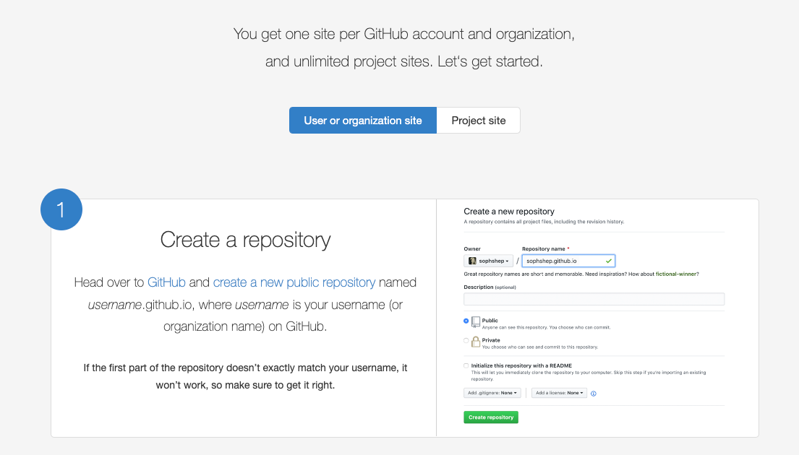
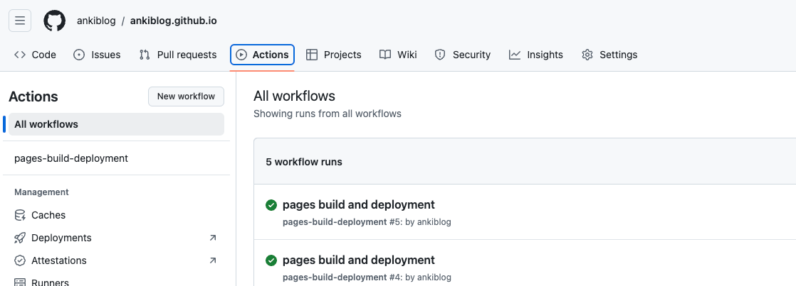

来日本生活后，手机里存了很多照片，一直想找个地方能分享手机里的照片，所以准备开始搞这个博客了。
之前一直是使用自己的独立域名和家里的树莓派服务器搭建的博客，自建服务器和独立域名的形式，存在维护成本高，资源利用率低的问题，所有自己DIY的东西，都需要自己去维护，另外，独立域名也比较容易暴露隐私，导致后来慢慢放弃了。

所以现在开始尝试用[Github Pages](https://pages.github.com/)搭建一个挂靠博客，结果出奇的方便，在不需要太多计算机方面的知识的情况下，也可以只花20分钟就搭建好一个自己的博客网站，并且几乎没有服务器维护成本。如果你也想搭建一个这样的博客，也可以试试Github Pages。

# 搭建步骤
## 申请github账户
博客需要一个专门的域名，使用github pages的话，会分配给你一个
github的域名，如果没有github账户，需要先注册github账户。每个账户可以分配一个下面形式的子域名，其中username是你注册的github账户名
> username.github.io

## 创建仓库
打开github page的创建页面，[Github Pages](https://pages.github.com/)  

有两种github page的初始化方式可以选择。  

- User or organization site: 这意味着你需要创建一个固定名称为`username.github.io`的仓库，最终你可以通过`http://username.github.io` 访问你这个仓库的内容。每个人只可以创建一个这样的仓库。

- Project site: 这意味着你可以创建一个任意名称的仓库例如'abcde'，最终你可以通过 `http://username.github.io/abcde` 访问你这个仓库的内容。

## 使用模板初始化自己的博客项目

创建好仓库后，下一步就是找一个喜欢的博客模板，放到自己的仓库中就可以了，github page提供了几个模板，也可以在[jekyll官方网站](https://jekyllrb.com/docs/themes/)上找自己喜欢的模板
GitHub.com #jekyll-theme repos
 - <https://jamstackthemes.dev>
 - <http://jekyllthemes.org>
 - <https://jekyllthemes.io>
 - <https://jekyll-themes.com>

找到喜欢的模板后，把模板的源码打包下载到本地，使用git上传到刚才创建的git仓库中，然后点击仓库的Actions按钮，等代码deploy成功后，就可以使用域名访问博客代码了

## 修改模板配置文件

下载的模版，一般在README里，或者下载页面会有使用说明，按照模板的使用说明在本地进行构建，然后把配置文件中的博客标题等信息修改成自己期望的内容，最后使用git提交代码，push到远程仓库中，等待部署完成即可看到内容已更新

## 发表博客内容

在_posts文件夹内新增.md文件，编辑博客内容，然后把修改提交到远程仓库即可完成发表

 
