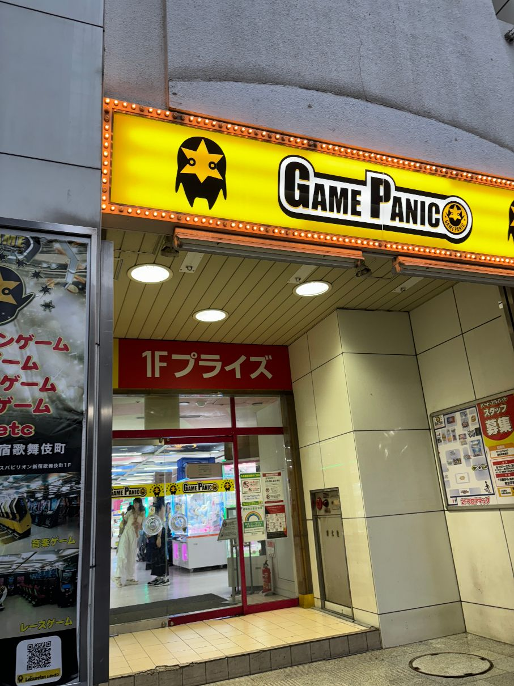
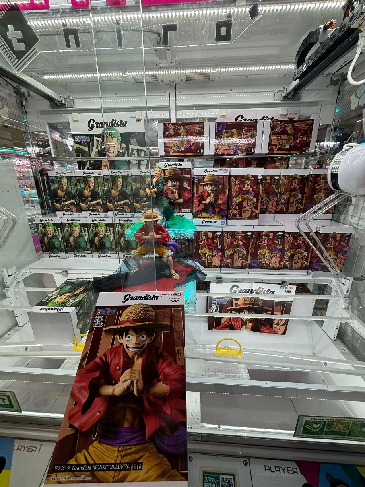
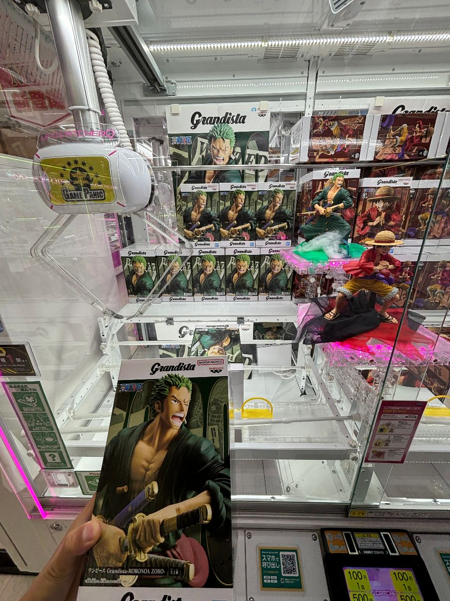
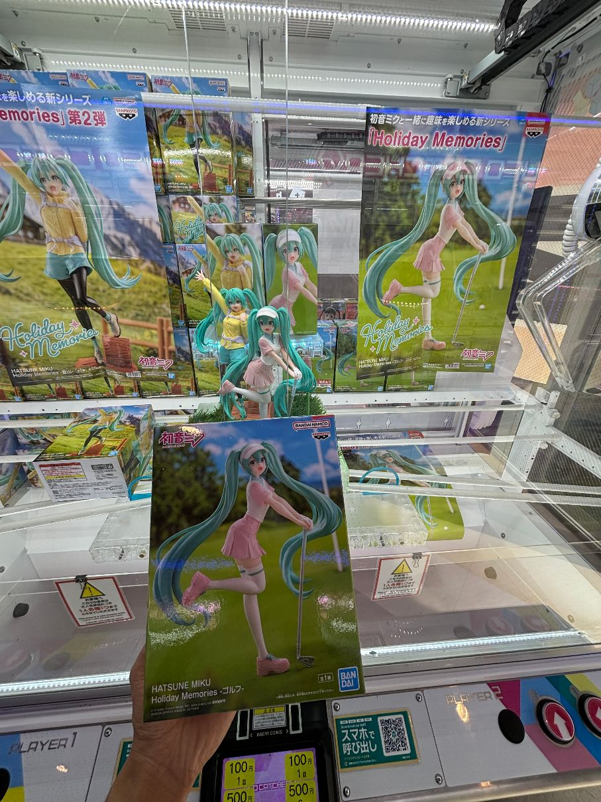
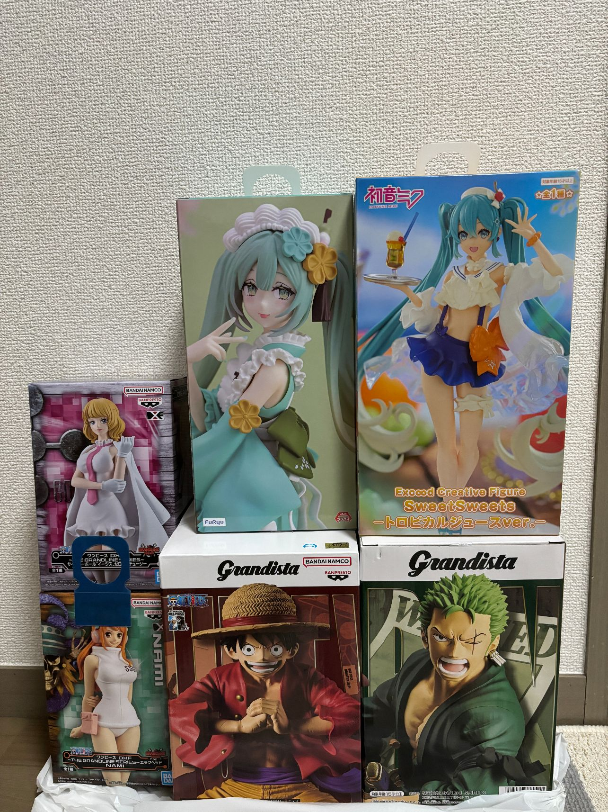

在东京秋叶原，新宿，涩谷等人流量大的地方，有很多大型的游戏厅，一般一半是抓娃娃机（ufo catcher），一半是游戏厅，娃娃机里面除了毛绒公仔外，摆放最多的就是动漫的景品手办，比如海贼王，火影等等，也有各种生活用品和小零食。连锁店比较多的的游戏厅是GiGO和Taito，娃娃机台数和种类都比较多，我经常去新宿的game panic，比较划算。

## 可以抓到吗？
国内的抓娃娃机，基本上没什么回头客，因为确实难抓到，但是日本这边的游戏厅，难度没有那么大，大部分手办抓够一定次数一定能抓到，每次我在一台机器面前抓了太久一直没有抓到，工作人员会过来帮我调整位置，如果过几次还是没有抓到，还会再过来调整到一次就掉下来到的位置，氪足够的钱就不会失望而归。另外国内娃娃机里面的奖品不怎么有吸引力，而日本这边的娃娃机内的手办更新换代很快，有足够的吸引力，特别是对宅男来说。

  
  
  

## 抓娃娃贵吗
价格普遍是100-200日币左右，取决于奖品的规格和抓的难度，一般的景品手办都是100一次，较大型一些的景品或者抓取难度较低的机器，会200日元。有的店铺会赠送抓的次数，例如500日元可以抓6次。推荐100日元一次的机器，比较划算，200元的虽然看上去简单，但是不会玩的还是抓不上来。
下面是在game panic花了2万日元抓的，稍微有点贵，主要是抓索隆花了快1万块了，其他的基本上2000日元左右能拿下，如果熟练的话，10次以内应该没啥问题

